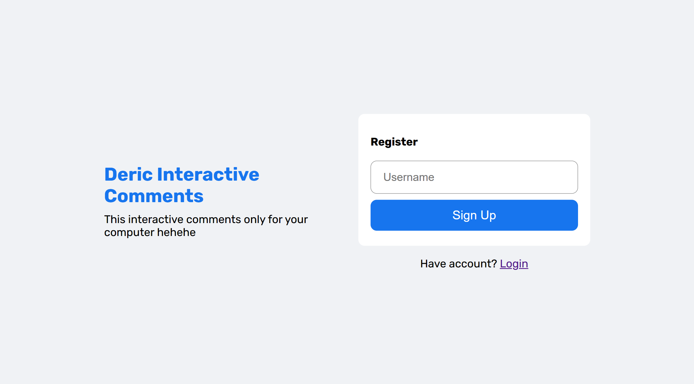
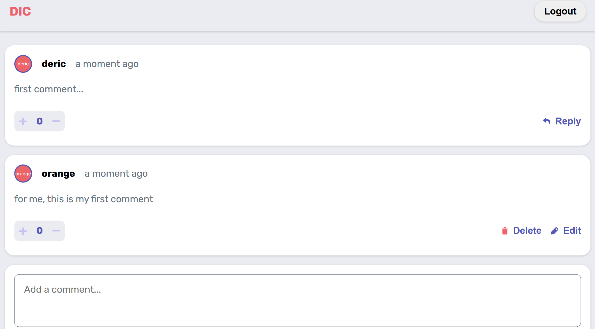
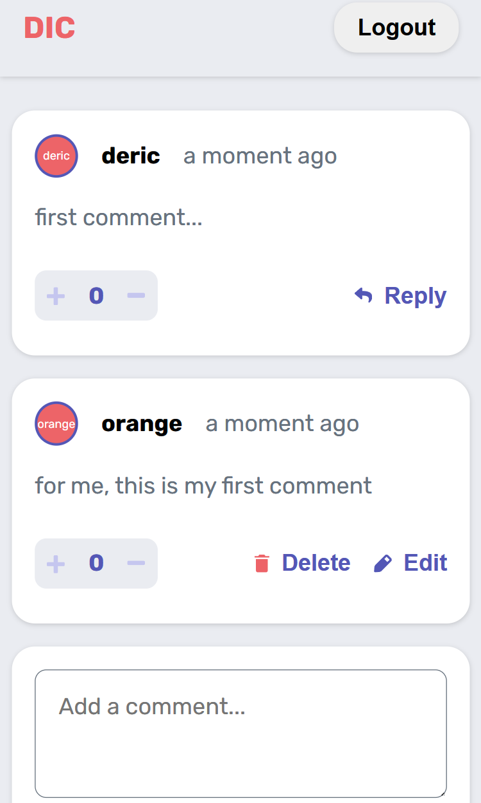

# Frontend Mentor - Interactive comments section solution

This is a solution to the [Interactive comments section challenge on Frontend Mentor](https://www.frontendmentor.io/challenges/interactive-comments-section-iG1RugEG9). Frontend Mentor challenges help you improve your coding skills by building realistic projects. 

## Table of contents

- [Overview](#overview)
  - [The challenge](#the-challenge)
  - [Screenshot](#screenshot)
  - [Links](#links)
- [My process](#my-process)
  - [Built with](#built-with)
  - [Continued development](#continued-development)
- [Author](#author)

## Overview

### The challenge

Users should be able to:

- View the optimal layout for the app depending on their device's screen size
- See hover states for all interactive elements on the page
- Create, Read, Update, and Delete comments and replies
- Upvote and downvote comments
- **Bonus**: If you're building a purely front-end project, use `localStorage` to save the current state in the browser that persists when the browser is refreshed.
- **Bonus**: Instead of using the `createdAt` strings from the `data.json` file, try using timestamps and dynamically track the time since the comment or reply was posted.

### Screenshot

For the first time to access this website, you will be asked to register a username. This username is only stored in your local storage.

### Links

- Solution URL: [My solution URL](https://www.frontendmentor.io/solutions/interactive-comments-site-JZSlduNkhD)
- Live Site URL: [My live site here](https://interactive-comments-bymde.netlify.app/)

## My process

### Built with

- CSS custom properties
- Flexbox
- [React](https://reactjs.org/) - JS library

### Continued development

further development, I still have to add functionality so that users can give likes in the form of increasing scores or decreasing scores, and this page still needs improvement in the form of editing users, so users can change their profile photos

## Author

- Frontend Mentor - [@muhammadderic](https://www.frontendmentor.io/profile/muhammadderic)
- Github - [@muhammadderic](https://github.com/muhammadderic)
